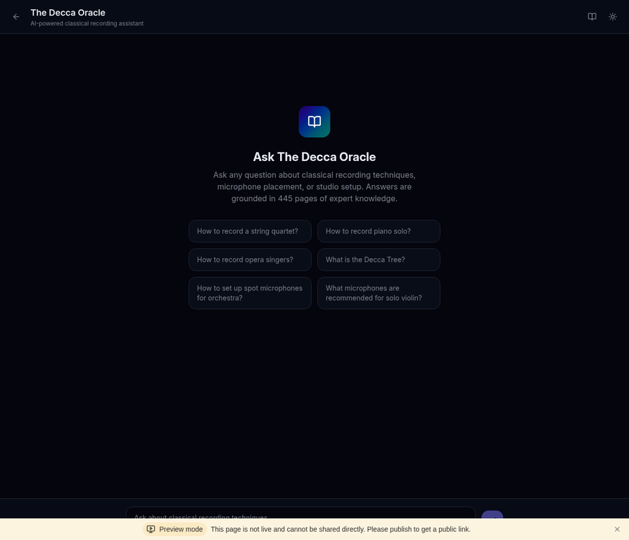
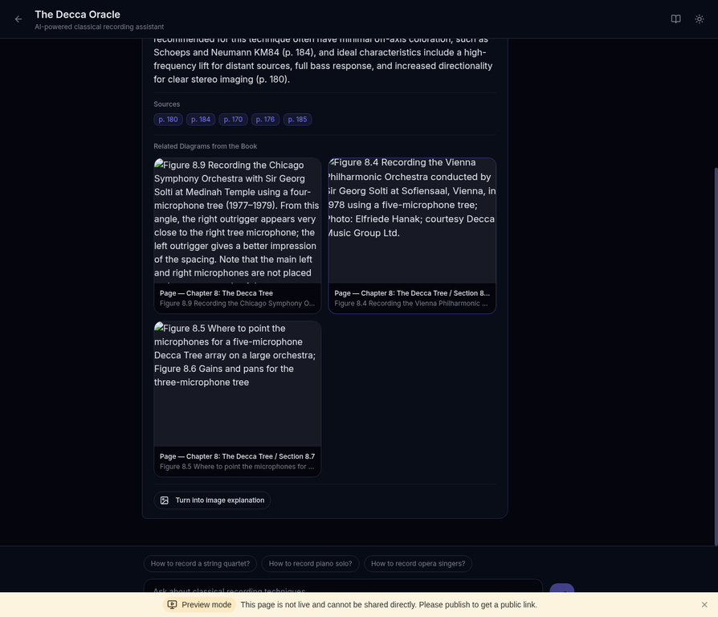
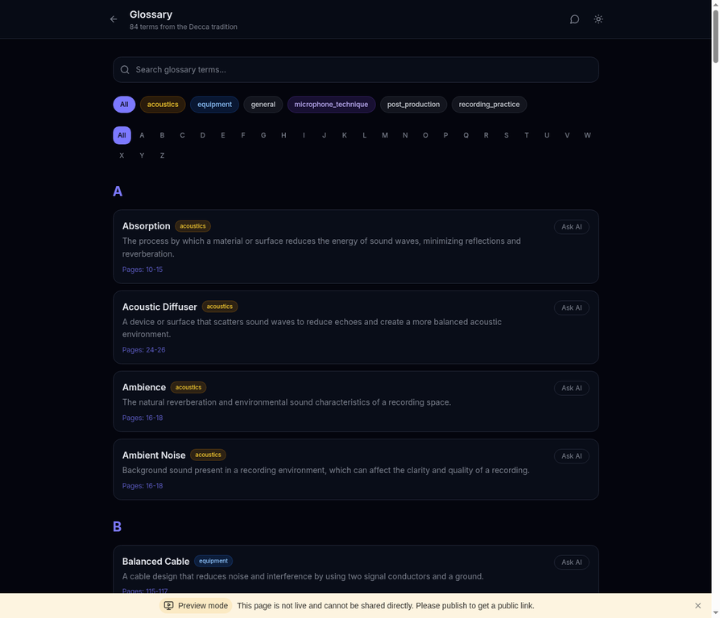
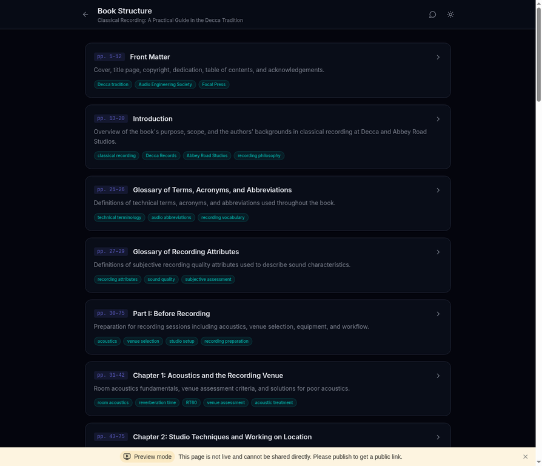
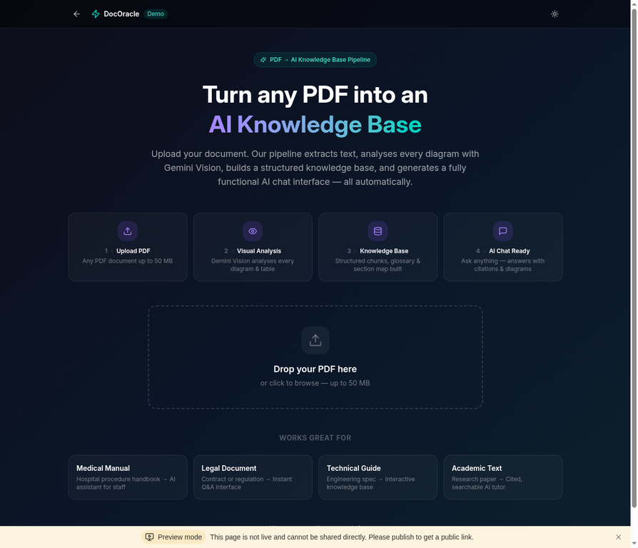

# DocOracle

**將任何 PDF 轉化為 AI 知識庫——包含聊天、圖表、引用，以及可部署的網站。**

DocOracle 是一個開源專案，能將任何 PDF 文件轉化為完整的結構化 AI 知識庫。它提取每一頁內容、以 Gemini Vision 分析每張圖表、建立可搜尋的資料，並可選擇性地生成互動式網站，讓使用者能夠提問並獲得以原始文件為依據的答案——每個回答都附有頁碼引用，並自動顯示相關圖表。


---

## 語言切換 | Language

[English](README.md) · [繁體中文](README.zh-TW.md) · [简体中文](README.zh-CN.md) · [日本語](README.ja.md) · [Deutsch](README.de.md)

---

## 為什麼選擇 DocOracle？（為什麼不直接把 PDF 上傳到 ChatGPT？）

你可能會想：*「我直接把 PDF 上傳到 ChatGPT 或 Claude 提問不就好了？」*

你確實可以這樣做——但以下是這樣做的結果：

| | 將 PDF 上傳至 ChatGPT/Claude | DocOracle |
|---|---|---|
| **頁碼引用** | 模糊或缺失——LLM 無法可靠地告訴你答案來自哪一頁 | 每個答案都包含精確的頁碼，因為流程保留了頁面邊界 |
| **圖表與圖片** | 被忽略或描述不清——大多數 LLM 完全跳過視覺內容 | 每張圖表、表格和照片都由 Gemini Vision 進行詳細的空間描述和檢索標籤分析 |
| **大型文件（200+ 頁）** | 上下文視窗溢出——LLM 會悄悄丟棄內容，導致答案不完整或產生幻覺 | 流程逐頁處理，然後建立檢索優化的分塊——不會遺失任何內容 |
| **一致性** | 每次問同一個問題可能得到不同答案 | 結構化 JSON 資料確保確定性檢索——相同的問題始終找到相同的依據 |
| **可重用性** | 鎖定在單一聊天會話中——無法分享、搜尋或進一步開發 | 輸出為標準 JSON 檔案，可驅動網站、供 RAG 系統使用，或整合到任何應用程式中 |
| **詞彙表與結構** | 無——只有原始答案，沒有導覽功能 | 自動生成帶有類別標籤的詞彙表、附有摘要和關鍵字標籤的章節/段落導覽 |
| **可分享的成果** | 一個私人聊天記錄 | 可部署的網站，供你的團隊、讀者、學生或客戶使用 |

簡而言之，將 PDF 上傳到 LLM 只能得到一次**一次性的對話**。DocOracle 給你的是**永久、結構化、可分享的知識庫**，保留每一頁、每張圖表和每個引用。

---

## 適合哪些人使用？

DocOracle 根據使用者的技術背景和目標，服務不同類型的使用者。請閱讀符合你情況的類別。

### 第 1 類——非技術使用者（無需編寫程式碼）

這類使用者希望在不編寫程式碼或執行腳本的情況下，將 PDF 轉化為 AI 知識庫。

#### 1.1 試用線上示範（零設定）

**你是：** 任何擁有 PDF 且想立即試用 DocOracle 的人，無需安裝任何東西。

**你要做的：** 前往 [DocOracle 線上示範](https://decca-oracle.manus.space)，點擊「用你的 PDF 試試」，上傳你的文件，等待流程處理完成。完成後，你可以直接在瀏覽器中與 AI 就你的文件進行聊天——附有引用和圖表。

**你需要的：** 一個網頁瀏覽器和一個 PDF 檔案。僅此而已。

> 這是體驗 DocOracle 最快的方式。無需下載、無需終端機、無需 API 金鑰。

#### 1.2 建立獨立的 AI 知識庫網站（無程式碼工具）

**你是：** 使用 AI 驅動的網頁建構工具（如 [Base44](https://base44.com)、[Lovable](https://lovable.dev)、[Vibecoding.ai](https://vibecoding.ai) 或 [Cursor](https://cursor.sh)）的使用者，希望從你的 PDF 建立自己的 AI 知識庫網站。

**你要做的：** 執行 DocOracle 流程（或讓 AI 代理為你執行——見[第 2 類](#第-2-類開發者與技術使用者)），將你的 PDF 處理成 4 個 JSON 資料檔案。然後使用你偏好的無程式碼建構工具，建立一個讀取這些 JSON 檔案並提供 AI 聊天介面的網站。你可以使用 DocOracle 的網站原始碼作為參考或提示模板。

**你獲得的：** 一個你擁有和控制的獨立網站，由你文件的內容驅動。

#### 1.3 為現有網站建立可嵌入的 AI 聊天小工具

**你是：** 已經擁有網站（公司網站、WordPress 部落格、作品集等）並希望在其中添加 AI 驅動的「詢問我的文件」聊天小工具的使用者。

**你要做的：** 與 1.2 相同，但不是建立完整網站，而是使用無程式碼工具建立一個輕量級聊天小工具，然後通過 `<iframe>` 或 `<script>` 標籤嵌入到你的現有網站中。

**你獲得的：** 嵌入在你現有網站中的 AI 聊天視窗——訪客無需離開你的網站即可就你的 PDF 內容提問。

---

### 第 2 類——開發者與技術使用者

這類使用者熟悉終端機、Python 和/或 JavaScript，希望對流程和輸出有更多控制。

#### 2.1 全端開發者（快速建立 AI 知識庫 MVP）

**你是：** 了解 React/Node.js 的開發者，希望快速為客戶或專案建立 AI 知識庫——而不需要從頭編寫整個 PDF 處理流程。

**你要做的：** 複製這個儲存庫，將你的 PDF 放在 `input/` 中，執行流程，然後啟動網站。根據需要自定義 UI、更換 LLM 提供商或擴展 API。請參閱下方的[快速開始](#快速開始)部分。

**你獲得的：** 一個在一天內就能運作的 AI 知識庫網站，包含聊天、詞彙表、章節導覽和視覺資產檢索——全部準備好可以演示或部署。

#### 2.2 使用 AI 代理僅執行流程（獲取 JSON 輸出）

**你是：** 想要流程輸出的結構化 JSON 資料，但不需要網站的開發者或資料工程師。你計劃將資料輸入到你自己的 RAG 系統、搜尋引擎或自定義應用程式中。

**你要做的：** 複製下方的現成提示，貼到任何有能力的 AI 代理（ChatGPT、Claude、Manus AI、Open Claw、Claude Cowork 等）中，並附上你的 PDF。AI 代理將執行完整流程並生成包含所有交付物的 `PDF_PROJECT_OUTPUT/` 資料夾。

**你獲得的：** 4 個關鍵 JSON 檔案（`page_chunks.jsonl`、`glossary.json`、`sections.json`、`visual_assets_index.json`）加上評估問題、系統提示和視覺資產元資料——全部為任何程式語言都可讀取的標準 JSON 格式。

> **此用例的複製貼上提示：** 請參閱 [`docs/PROMPT_PIPELINE_ONLY.md`](docs/PROMPT_PIPELINE_ONLY.md)

#### 2.3 使用 AI 代理執行流程並建立網站（端到端）

**你是：** 希望 AI 代理完成所有工作的開發者、創始人或技術使用者——在單一會話中處理 PDF 並建立完整的可部署 AI 知識庫網站。

**你要做的：** 複製下方的現成提示，貼到有能力的 AI 代理（Manus AI、Claude Cowork、Open Claw 等）中，並附上你的 PDF。AI 代理將執行完整流程、生成 JSON 資料，然後建立並部署帶有 AI 聊天、詞彙表、章節導覽和視覺資產檢索的互動式網站。

**你獲得的：** 一個功能完整的 AI 知識庫網站，準備好與你的團隊、客戶或受眾分享。

> **此用例的複製貼上提示：** 請參閱 [`docs/PROMPT_PIPELINE_AND_WEBSITE.md`](docs/PROMPT_PIPELINE_AND_WEBSITE.md)

#### 2.4 後端/資料工程師（僅使用流程，建立自己的前端）

**你是：** 已有前端或應用程式的 Python 開發者或資料工程師。你只需要一個可靠的 PDF 轉結構化資料流程。

**你要做的：** 僅使用 `pipeline/` 目錄。在你的本地機器上執行腳本。輸出的 JSON 檔案可以整合到任何技術棧中——Python、PHP、Go、Java、Ruby 或任何能讀取 JSON 的語言。

**你獲得的：** 乾淨、結構化的 JSON 資料，包含頁面級文字分塊、詞彙表、章節層次結構和視覺資產元資料——準備好插入到你的現有系統中。

---

### 第 3 類——商業與企業使用者

這類使用者有希望使其可搜尋並具備 AI 功能的文件，但可能需要技術協助進行設定。

#### 3.1 企業培訓/人力資源部門

**你是：** 擁有 PDF 格式員工手冊、標準作業程序、合規手冊或入職材料的人力資源經理或培訓負責人。

**你的目標：** 讓員工能夠提問，如「*請假政策是什麼？*」或「*如何提交費用報告？*」，並獲得帶有頁碼參考的即時準確答案——而不是在 200 頁的 PDF 中搜尋。

**如何使用 DocOracle：** 讓你的 IT 團隊執行流程（或使用第 2 類中的提示使用 AI 代理），然後在內部為你的員工部署網站。

#### 3.2 作者與出版商

**你是：** 撰寫了一本書或手冊並希望為讀者提供 AI 驅動伴侶的作者、技術寫作者或出版商。

**你的目標：** 讓讀者能夠提問，如「*第 5 章涵蓋什麼內容？*」或「*解釋光圈與景深之間的關係*」，並獲得以你的書為依據的答案，附有頁碼引用。

**如何使用 DocOracle：** 通過流程處理你的書的 PDF，然後將網站部署為你出版物的伴侶。你的讀者將獲得「詢問這本書」的 AI 體驗。

---

### 第 4 類——研究人員與學者

#### 4.1 研究人員、學者和研究生

**你是：** 處理冗長的政府報告、學術論文、政策文件或技術規範的研究人員。

**你的目標：** 快速找到埋藏在 500 頁文件中的特定條款、資料點或論點——而不需要從頭到尾閱讀。

**如何使用 DocOracle：** 在你的文件上執行流程，並在本地啟動網站（無需公開部署）。使用 AI 聊天以完整引用支援查詢你的文件。

---

### 第 5 類——教育工作者與培訓機構

#### 5.1 教師與教育機構

**你是：** 擁有教科書、講義或學習材料的教師、教授或補習中心。

**你的目標：** 為學生提供 AI 學習助手，回答「*牛頓第三定律是什麼？*」等問題，答案以實際教科書為依據——引用具體頁面，而不是生成通用回應。

**如何使用 DocOracle：** 處理教科書 PDF，為你的學生部署網站。每個答案都包含頁碼，讓學生可以在原始材料中驗證並進一步閱讀。

---

### 快速參考：哪條路適合你？

| # | 使用者類型 | 技術水平 | 你使用的 | 你獲得的 |
|---|-----------|---------|---------|---------|
| 1.1 | **線上示範使用者** | 無 | 線上示範網站 | 與你的 PDF 即時 AI 聊天 |
| 1.2 | **無程式碼建構者（獨立網站）** | 低 | 流程 + 無程式碼工具 | 你自己的 AI 知識庫網站 |
| 1.3 | **無程式碼建構者（嵌入小工具）** | 低 | 流程 + 無程式碼工具 | 你現有網站上的 AI 聊天小工具 |
| 2.1 | **全端開發者** | 高 | 流程 + 網站模板 | 可自定義的 AI 知識庫 MVP |
| 2.2 | **AI 代理使用者（僅流程）** | 中 | 複製貼上提示 + AI 代理 | 用於你自己系統的 JSON 資料 |
| 2.3 | **AI 代理使用者（流程 + 網站）** | 中 | 複製貼上提示 + AI 代理 | 完整的 AI 知識庫網站 |
| 2.4 | **後端/資料工程師** | 高 | 僅流程 | 用於你自己系統的 JSON 資料 |
| 3.1 | **企業/人力資源** | 低（需要 IT 協助） | 流程 + 網站 | 內部員工知識庫 |
| 3.2 | **作者/出版商** | 低至中 | 流程 + 網站 | 你書籍的 AI 伴侶 |
| 4.1 | **研究人員/學者** | 中 | 流程 + 網站（本地） | 私人文件知識庫 |
| 5.1 | **教師/教育工作者** | 低至中 | 流程 + 網站 | 學生的 AI 學習助手 |

---

## 功能特色

DocOracle 接受 PDF 並分兩個階段生成完整的可部署 AI 知識庫：

**第一階段：流程** — 一組在你的本地機器上處理 PDF 的 Python 腳本。流程從每一頁提取文字，使用 Gemini Vision 分析圖表和表格，對頁面類型進行分類，建立詞彙表，生成章節摘要，並創建檢索優化的分塊。

**第二階段：網站** — 一個提供已處理知識庫的全端 Web 應用程式（React + Express + tRPC）。使用者可以與 AI 聊天、瀏覽詞彙表、導覽書籍結構，並在答案旁邊看到相關圖表。

```
┌─────────────┐     ┌──────────────────┐     ┌─────────────────────┐
│             │     │                  │     │                     │
│  你的 PDF   │────▶│  流程（12 個     │────▶│  AI 知識庫網站      │
│  （任何書籍）│     │  Python 腳本）   │     │  （React + Express  │
│             │     │                  │     │  + Gemini）         │
└─────────────┘     └──────────────────┘     └─────────────────────┘
     input/              pipeline/                 website/
```

---

## 線上示範截圖

### 帶引用和圖表的 AI 聊天

詢問有關書籍內容的任何問題。每個答案都包含頁面級引用，相關圖表會自動檢索並顯示。





### 詞彙表瀏覽器

瀏覽所有技術術語，支援字母過濾和類別標籤。每個術語都連結到其來源頁面。



### 書籍結構導覽器

探索完整的章節和段落結構，附有摘要和關鍵字標籤。



### DocOracle 示範——上傳你自己的 PDF

內建示範頁面讓任何人都可以上傳 PDF 並親身體驗完整流程。



---

## 功能列表

| 功能 | 描述 |
|------|------|
| **Gemini Vision 分析** | 每張圖表、表格和圖片都由 Gemini Vision 進行詳細的空間描述分析 |
| **帶引用的 AI 聊天** | 提問並獲得以文件為依據的答案，附有頁碼引用 |
| **視覺資產檢索** | 相關圖表自動出現在聊天答案旁邊 |
| **詞彙表瀏覽器** | 帶有類別標籤和頁碼參考的字母詞彙表 |
| **章節導覽器** | 帶有摘要和關鍵字標籤的完整書籍結構 |
| **圖片說明** | 「轉換為圖片說明」按鈕為複雜答案生成 AI 視覺摘要 |
| **深色/淺色主題** | 在深色和淺色模式之間切換 |
| **PDF 上傳示範** | 用於上傳和處理新 PDF 的內建介面 |

---

## 快速開始

> 本節適用於**開發者**（使用者類型 2.1 和 2.4）。如果你是非技術使用者，請參閱上方的[第 1 類](#第-1-類非技術使用者無需編寫程式碼)。

### 先決條件

| 需求 | 版本 | 用途 |
|------|------|------|
| Python | 3.9+ | 流程腳本 |
| Node.js | 18+ | 網站 |
| pdftotext | 任意 | 文字提取（`sudo apt-get install poppler-utils`） |
| Gemini API 金鑰 | — | Vision 分析和聊天（[獲取免費金鑰](https://aistudio.google.com/app/apikey)） |

### 步驟 1：複製儲存庫

```bash
git clone https://github.com/dev-james0723/DocOracle.git
cd DocOracle
```

### 步驟 2：放置你的 PDF

```bash
cp /path/to/your/book.pdf input/
```

### 步驟 3：安裝流程依賴項

```bash
pip install -r pipeline/requirements.txt
```

### 步驟 4：設定你的 API 金鑰

```bash
export GEMINI_API_KEY="your-gemini-api-key"
```

### 步驟 5：執行流程

```bash
bash pipeline/run_all.sh
```

流程將通過 12 個步驟處理你的 PDF。處理時間取決於頁數：

| 頁數 | 預估時間 |
|------|---------|
| 50 | ~15 分鐘 |
| 200 | ~1 小時 |
| 500 | ~3 小時 |

### 步驟 6：啟動網站

```bash
# 將 4 個關鍵輸出檔案複製到網站
cp output/05_retrieval/page_chunks.jsonl website/server/data/
cp output/04_gold_master/glossary.json website/server/data/
cp output/04_gold_master/sections.json website/server/data/
cp output/10_visual_assets/visual_assets_index.json website/server/data/visual_assets.json

# 安裝並啟動網站
cd website
npm install
npm run dev
```

在瀏覽器中打開 `http://localhost:3000`。你的 AI 知識庫已準備就緒。

---

## 使用 AI 代理使用 DocOracle（使用者類型 2.2 和 2.3）

如果你希望讓 AI 代理為你完成工作，DocOracle 提供了現成的提示，你可以複製並貼到任何有能力的 AI 代理中。

### 支援的 AI 代理

| AI 代理 | 最適合 | 備注 |
|---------|--------|------|
| [Manus AI](https://manus.im) | 流程 + 網站（端到端） | 具有檔案系統存取的完全自主執行 |
| [Claude](https://claude.ai)（帶 Projects 或 Artifacts） | 流程提示執行 | 擅長遵循結構化提示 |
| [ChatGPT](https://chatgpt.com)（帶 Code Interpreter） | 流程提示執行 | 可以執行 Python 腳本和處理檔案 |
| [Open Claw](https://openclaw.com) | 流程 + 網站 | 帶工具使用的開源 AI 代理 |
| [Cursor](https://cursor.sh) | 網站自定義 | AI 驅動的程式碼編輯器，非常適合修改網站模板 |

### 提示 A：僅流程（獲取 JSON 輸出）

當你想要結構化資料檔案但計劃建立自己的前端或整合到現有系統時使用。

**完整提示與說明：** [`docs/PROMPT_PIPELINE_ONLY.md`](docs/PROMPT_PIPELINE_ONLY.md)

### 提示 B：流程 + 網站（端到端）

當你希望 AI 代理在一個會話中處理你的 PDF 並建立完整的可部署網站時使用。

**完整提示與說明：** [`docs/PROMPT_PIPELINE_AND_WEBSITE.md`](docs/PROMPT_PIPELINE_AND_WEBSITE.md)

---

## 流程步驟

流程由 12 個按順序執行的 Python 腳本組成：

| 步驟 | 腳本 | 功能 |
|------|------|------|
| 1 | `01_build_inventory.py` | 將每一頁分類為文字、圖表、照片或混合 |
| 2 | `02_generate_page_records.py` | 使用 Gemini Vision 為每一頁創建詳細記錄 |
| 3 | `03_merge_all_records.py` | 將文字提取和視覺分析合併為黃金主記錄 |
| 4 | `04_build_visual_summary.py` | 為高風險視覺頁面生成摘要 |
| 5 | `05_build_sections_glossary.py` | 建立章節/段落結構和詞彙表 |
| 6 | `06_build_glossary_faq.py` | 從內容生成 FAQ 種子 |
| 7 | `07_build_retrieval.py` | 為 RAG 創建檢索優化的分塊 |
| 8 | `08_build_eval.py` | 生成 80+ 個評估問題用於測試 |
| 9 | `09_identify_visual_pages.py` | 識別所有帶有圖表、表格或圖片的頁面 |
| 10 | `10_build_visual_assets.py` | 將視覺資產提取為單獨的圖片 |
| 11 | `11_build_visual_metadata.py` | 將每個視覺資產與描述性元資料配對 |
| 12 | `12_build_url_map.py` | 建立用於網頁顯示的 URL 映射 |

---

## 授權

本專案採用 MIT 授權——詳情請參閱 [LICENSE](LICENSE) 檔案。

**重要：** DocOracle 是一個用於處理你有合法使用權的文件的工具。流程和網站程式碼是開源的；你處理的文件是你的責任。切勿上傳你沒有使用許可的受版權保護的材料。

---

<p align="center">
  <strong>DocOracle</strong> — 因為每份文件都值得被理解。
</p>
